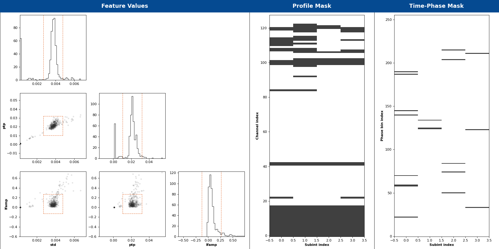

[](https://arxiv.org/abs/1811.04929)    

# clfd

``clfd`` stands for **cl**ean **f**olded **d**ata, and implements two interference removal algorithms to be used on _folded_ pulsar search and pulsar timing data. They are based on a simple outlier detection method and require very little human input. These algorithms were initially developed for a re-processing of the High Time Resolution Universe (HTRU) survey, and can be credited with the discovery of several pulsars that would have otherwise been missed.

## Citation

If using ``clfd`` contributes to a project that leads to a scientific publication, please cite  
["The High Time Resolution Universe survey XIV: Discovery of 23 pulsars through GPU-accelerated reprocessing"](https://arxiv.org/abs/1811.04929)

## How it works

A detailed explanation of what ``clfd`` does can be found in section 2.4 of the above article. There are two algorithms:

- **Profile masking**: Convert each profile (there is one per channel and per sub-integration) to a small set of summary statistics called _features_ (e.g. standard deviation, peak-to-peak difference, ...); then, idenfify outliers in the resulting feature space using [Tukey's rule for outliers](https://en.wikipedia.org/wiki/Outlier#Tukey's_fences). Outlier profiles are flagged, i.e. their PSRCHIVE weights are set to 0.
- **Time-phase spike subtraction**: Without dedispersing, integrate the input folded data cube along the frequency axis; identify outliers in the resulting 2D array, which are flagged as bad (time, phase) bins; replace the data in those bins in the input data cube along the frequency dimension. Replacement values are automatically chosen.

Here's the report plot from `clfd` after running it on the example archive provided in the repository. The orange dashed lines delimit the acceptable range of values for each feature. Points lying outside correspond to profiles that should be masked.



## Extra dependencies

`clfd` has little reason to exist without the [PSRCHIVE](http://psrchive.sourceforge.net/) python bindings, which it uses to read and write folded archives. Unless you are working on an HPC facility where someone has already done the job for you, you will have to build PSRCHIVE with Python support. We hope to provide a guide on how to do this in the future. In the meantime, the Dockerfile in this repository can provide some guidance.

## Installation

### From PyPI

To install the latest release:
```
pip install clfd
```

The main command-line application should now be available to run, see below for more details.
```
clfd --help
```


### Editable installation / Contributing

If you want to freely edit the code or perhaps contribute to development, clone the repository and in the base directory of `clfd` run:

```bash
pip install -e .[dev]
```

This performs an [editable install](https://pip.pypa.io/en/latest/reference/pip_install/#editable-installs) with additional development dependencies.


### The PYTHONPATH method

If you are not allowed to install packages with ``pip`` (this may be the case on some computing clusters), or perhaps want to work around the idiosyncratic installation process of the PSRCHIVE Python bindings, then you can clone the repository and add the base directory of ``clfd`` to your ``PYTHONPATH`` environment variable, but then:  
1. You have to install the required dependencies manually.
2. The main command-line application `clfd` (see below) will **NOT** be made available in your `PATH` automatically.

We warmly recommend using one of the methods above unless you have no other option.

## Usage

For detailed help on every option:

```
clfd --help
```

A typical command might be:

```
clfd --features std ptp lfamp --despike *.ar
```

Note that profile masking is systematically performed, but spike subtraction is optional and can be enabled with `--despike`.

By default, `clfd` saves three files per input archive:
- A cleaned archive with an additional `.clfd` extension appended
- A PNG report plot as shown above
- A so-called report, which contains all intermediate results of the cleaning process, in a customised JSON format.

Reports can be loaded and interacted with as follows:
```python
from clfd import Report
r = Report.load("<filename>.json")
```

### What profile features to use

The user may choose a subset of the following features on the command line (see below):
- `ptp`: peak to peak difference
- `std`: standard deviation
- `var`: variance
- `lfamp`: amplitude of second bin in the Fourier transform of the profile
- `skew`: skewness
- `kurtosis`: excess kurtosis
- `acf`: autocorrelation with a lag of 1 phase bin

**The choice of profile features should be motivated by the dynamic range of the data.** Depending on the digitization / scaling scheme employed by the telescope backend, on some observing systems the mean and scale of the data may vary wildly across the band and the mean / standard deviation of the data in a given channel do not correlate well with the presence of interference. In such cases, you should use features that are insensitive to the scale of the data. Our recommendation is below, but feel free to experiment:
- Low dynamic range: `std`, `ptp` and/or `lfamp`. Recommended for older 1-bit and 2-bit Parkes multibeam receiver data for example.
- High dynamic range: `skew`, `kurtosis`, and/or `acf`. Recommended for any Parkes UWL data in particular.
