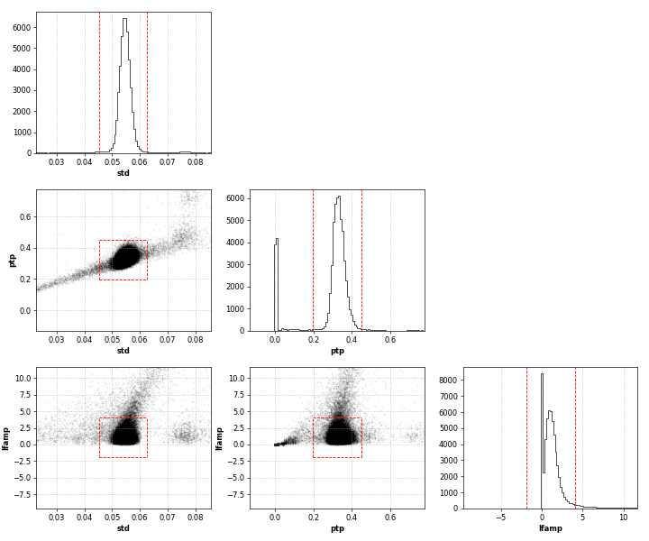
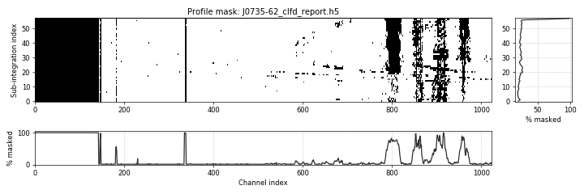

[](https://arxiv.org/abs/1811.04929)    

# clfd

``clfd`` stands for **cl**ean **f**olded **d**ata, and implements smart interference removal algorithms to be used on _folded_ pulsar search and pulsar timing data. They are based on a simple outlier detection method and require very little to no human input, which is the main reason for their efficacy. These cleaning algorithms were initially developed for a complete re-processing of the High Time Resolution Universe (HTRU) survey, and can be credited with the discovery of several pulsars that would have otherwise been missed.

## Citation

If using ``clfd`` contributes to a project that leads to a scientific publication, please cite the article  
["The High Time Resolution Universe survey XIV: Discovery of 23 pulsars through GPU-accelerated reprocessing"](https://arxiv.org/abs/1811.04929)

A detailed explanation of ``clfd``'s algorithms and a visual demonstration of what they can do on real Parkes data can be found in section 2.4. The idea is to convert each profile (there is one profile per channel and per sub-integration) to a small set of representative features (e.g. standard deviation, peak-to-peak difference) and to flag outliers in the resulting feature space. Since v0.2.2, ``clfd``  outputs report plots to visualize the outlier flagging process and the resulting two-dimensional time-frequency mask applied to the clean archive. Here's the output of a ``clfd`` run on a Parkes observation of the pulsar J0735-62, where the red lines delimit the automatically inferred acceptable value range for each feature:





## Interfaces to existing data formats

The implementation of the cleaning algorithms is entirely decoupled from the input/output data format, and interfaces to any folded data format can be easily implemented. Currently, ``clfd`` can read and write PSRFITS archives via the python bindings of [PSRCHIVE](http://psrchive.sourceforge.net/). An interface to [PRESTO](https://www.cv.nrao.edu/~sransom/presto/)'s pfd archives can be added if there are any expressions of interest.


## Extra dependencies

`clfd` has little reason to exist without the [PSRCHIVE](http://psrchive.sourceforge.net/) python bindings, which it uses to read and write archives. Unless you are working on an HPC facility where someone has already done the job for you, you will have to build PSRCHIVE yourself, with Python support.

We hope to provide a guide on how to do this in the future. In the meantime, you may use the Dockerfile in this repository for cautious inspiration.


## Installation

#### From PyPI

The easiest method is to install the latest release is:
```
pip install clfd
```

The main command-line application should now be available to run, see below for more details.
```
clfd --help
```


#### Editable installation

If you want to freely edit the code and perhaps contribute, clone the repository and in the base directory of `clfd` run:

```bash
pip install -e .[dev]
```

Which performs an [editable install](https://pip.pypa.io/en/latest/reference/pip_install/#editable-installs) with additional development dependencies.


#### The PYTHONPATH method

If you are not allowed to install packages with ``pip`` (this may be the case on some computing clusters), or perhaps want to work around the idiosyncratic installation process of the PSRCHIVE Python bindings, then you can clone the repository and add the base directory of ``clfd`` to your ``PYTHONPATH`` environment variable, but then:  
1. You have to install the required dependencies manually.
2. The main command-line application `clfd` (see below) will **NOT** be made available in your `PATH` automatically.

We warmly recommend using one of the methods above unless you have no other option.

## What features / profile statistics to use

`clfd` identifies bad profiles in a folded data cube based on whether certain profile features (i.e. summary statistics) are outside an acceptable range of values inferred from the majority of the data. The user may choose a combination of the following features on the command line (see below):
- `ptp`: peak to peak difference
- `std`: standard deviation
- `var`: variance
- `lfamp`: amplitude of second bin in the Fourier transform of the profile
- `skew`: skewness
- `kurtosis`: excess kurtosis
- `acf`: autocorrelation with a lag of 1 phase bin

**The choice of profile features should be motivated by the dynamic range of the data.** Depending on the digitization / scaling scheme employed by the telescope backend, on some observing systems the mean and scale of the data may vary wildly across the band and the mean / standard deviation of the data in a given channel do not correlate well with the presence of interference. In such cases, you should use features that are insensitive to the scale of the data. The official recommendation is as follows, but feel free to experiment:  
- Low dynamic range: `std`, `ptp` and/or `lfamp`. Recommended for older 1-bit and 2-bit Parkes multibeam receiver data for example.
- High dynamic range: `skew`, `kurtosis`, and/or `acf`. Recommended for any Parkes UWL data in particular.


## Command line usage

If your installation went well, a command-line application `clfd` should now appear in your `PATH` and be callable from anywhere. It points to the ``cleanup.py`` script in the ``apps`` sub-directory, and can batch process multiple files / archives at once. For detailed help on command line arguments:

```bash
clfd -h
```

Running with default arguments should work well in most of cases, **but the choice of profile features should be strongly motivated by the dynamic range of the data.** On some observing systems, the mean and scale of the data can vary wildly across the band and thus the mean and standard deviation of the data in a given channel do not correlate well with the presence of interference. In such cases, you should use features that are insensitive to the scale of the data. The official recommendation is:  
- Low dynamic range / bit depth: `std`, `ptp` and/or `lfamp`. Recommended for 1-bit and 2-bit Parkes multibeam receiver data in particular.
- High dynamic range: `skew`, `kurtosis`, and/or `acf`. Recommended for any Parkes UWL data in particular.


For example, to process a batch of `PSRCHIVE` archive files placed in the ``~/folded_data`` directory:
```
clfd ~/folded_data/*.ar
```
This leaves the input files intact, and produces cleaned copies which are placed in the same directory, with the an additional ``.clfd`` extension appended. Report files in HDF5 format are also saved as ``BASENAME_clfd_report.h5`` where ``BASENAME`` is the archive file name without its extension. A Report stores all inputs and outputs of a clfd run on an archive, they can easily be loaded and manipulated interactively in IPython. See also section "Working with reports" below for more details.

```python
>>> from clfd import Report
>>> r = Report.load("SomeArchive_clfd_report.h5")
>>> r.corner_plot()
>>> r.profile_mask_plot()
```

The masking of bad time-phase bins can be enabled with the `--despike` option. However, it is disabled by default as there is a small chance that it could affect pulses from a very bright low-DM pulsar, and it also tends to fail in the worst RFI environments. Be careful when using that option, and check that you are getting an improvement of data quality out of it.


## Interactive Usage

The command-line application may be the most practical way of getting the job done, but it just calls functions that are accessible to the user as well. It might be useful to check or plot intermediate outputs. The example below exposes the computation steps: featurization, outlier flagging and application of the outlier mask to the original archive.

```python
>>> import psrchive
>>> import clfd

# Load folded archive produced with PSRCHIVE
>>> cube = clfd.DataCube.from_psrchive("archive.ar")

# Compute chosen profile features.
# The output is a pandas DataFrame with feature names as columns, and (subint, channel) tuples as rows.
>>> features = clfd.featurize(cube, features=('std', 'ptp', 'lfamp'))
>>> print(features)
                     std       ptp     lfamp
subint channel                              
0      0        0.042826  0.224936  0.786012
       1        0.000210  0.003367  0.003367
       2        0.002779  0.006757  0.009283
       3        0.002778  0.006757  0.020955
...                  ...       ...       ...
57     1020     0.050708  0.309764  0.171277
       1021     0.048685  0.272727  0.928349
       1022     0.055210  0.314584  1.463649
       1023     0.058338  0.346801  1.077389

[59392 rows x 3 columns]

# From there, compute profile mask, optionally excluding some known bad channels from the analysis. 
# The example archive here contains Parkes BPSR data, and we know that the first 150 channels are always bad.
>>> stats, mask = clfd.profile_mask(features, q=2.0, zap_channels=range(150))

# 'stats' contains the 1st and 3rd quantiles, inter-quartile range and min/max acceptable values for each feature.
# vmin = q1 - q x iqr
# vmax = q3 + q x iqr
# Where 'q' is the parameter passed to the profile_mask function above.
>>> print(stats)

           std       ptp     lfamp
q1    0.037299  0.202817  0.376125
q3    0.040031  0.235003  0.918363
iqr   0.002733  0.032185  0.542239
vmin  0.031833  0.138447 -0.708352
vmax  0.045497  0.299373  2.002841

# 'mask' is a boolean array of shape (num_subints, num_channels), whose value is True for bad profiles.
# Any frequency channels specified via the 'zap_channels' argument above are forcibly set to True
>>> mask.shape
(58, 1024)

>>> mask
array([[ True,  True,  True, ..., False, False, False],
       [ True,  True,  True, ..., False, False, False],
       [ True,  True,  True, ..., False, False, False],
       ...,
       [ True,  True,  True, ..., False, False, False],
       [ True,  True,  True, ..., False, False, False],
       [ True,  True,  True, ...,  True,  True,  True]])

# Applying the mask to the original archive and saving the output is a format-dependent operation. 
# For each format there is a corresponding Handler class in the clfd.handlers sub-module, which implements methods to apply a mask to the original file and save the output.
>>> from clfd.interfaces import PsrchiveInterface

# In PSRCHIVE, every profile has a weight parameter. This sets the weight of every bad profile to 0.
# We can then save the clean data as a new archive in PSRFITS format.
>>> archive = psrchive.Archive_load("archive.ar")
>>> PsrchiveInterface.apply_profile_mask(mask, archive)
>>> PsrchiveInterface.save("archive_clean.ar", archive)

# Optionally, we can then use the zero DM spike removal algorithm. Here the idea is to look for
# outliers in the zero DM time-phase plot, and replace them by appropriate values (inferred 
# from the data) across the frequency dimension.
>>> tpmask, valid_chans, repvals = clfd.time_phase_mask(cube, q=4.0, zap_channels=zap_channels)

# 'mask' is a boolean array of shape (num_subints, num_phase_bins), whose value is True for bad time-phase bins.
# 'valid_chans' is the list of channels NOT included in zap_channels
# 'repvals' is a numpy array with the same shape as the data cube, containing appropriate replacement values
>>> PsrchiveInterface.apply_time_phase_mask(tpmask, valid_chans, repvals, archive)
>>> PsrchiveInterface.save("archive_cleanest.ar", archive)
```

## Working with reports

Running the main command line application produces report files with some useful information about the cleaning performed. Reports store all inputs and outputs of a clfd run on an archive. **NOTE: Reports are very much a feature in development and may change in the future**. At the moment (``v0.2.2`` and above), a Report object has the following attributes:

- ``frequencies``: channel frequencies in MHz
- ``feature_names``: list of feature names used
- ``features``: pandas.DataFrame returned by the ``featurize()`` function
- ``stats``: pandas.DataFrame returned by the ``featurize()`` function
- ``profmask``: boolean profile mask returned by the ``profile_mask()`` function. This is a numpy array with shape (num_subints, num_channels)
- ``qmask``: value of the Tukey parameter ``q`` passed to ``profile_mask()``
- ``zap_channels``: zap_channels argument that passed to ``profile_mask()``
- ``tpmask``: mask returned by ``time_phase_mask()`` if the function was called (i.e. when the cleanup executable is called with the ``--despike`` option). If time_phase_mask() was NOT called, tpmask will be ``None``. Otherwise, ``tpmask`` is a numpy array with shape (num_subints, num_phase_bins).
- ``qspike``: value of the Tukey parameter 'q' passed to ``time_phase_mask()``. If ``time_phase_mask()`` was NOT called, tpmask will be ``None``.
- ``version``: version of clfd that was used to produce this report.

And there are two methods to generate nice plots, of which you can see examples above:
- ``corner_plot()``: pairwise scatter plot of profile features and single feature histograms. Each point represents a single profile (there is one profile per (subint, channel) tuple), and the red lines the inlier (i.e. acceptable) value ranges for each feature. Anything outside the inlier range has been flagged as anomalous and zero-weighted in the output archive.
- ``profile_mask_plot()``: A view of the two-dimensional profile mask, along with the fraction of data masked in each channel and each sub-integration.

More attributes and plots will be added in future versions.